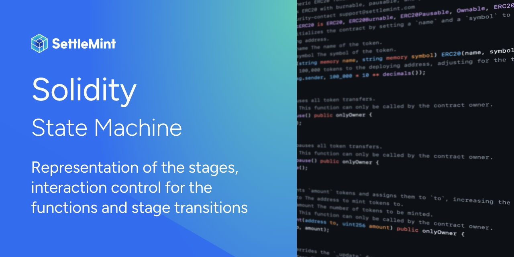

# Statemachine

Example statemachine contract.

## Get started

Launch this smart contract set in the SettleMint Blockchain Transformation platform under the `Smart Contract Sets` section. This will automatically link it to your own blockchain node and make use of the private keys living in the platform.

If you want to use it separately, bootstrap a new project using

```shell
forge init my-erc20-token --template settlemint/solidity-token-erc20
```

## DX: Foundry

**Foundry is a blazing fast, portable and modular toolkit for Ethereum application development written in Rust.**

Foundry consists of:

- **Forge**: Ethereum testing framework (like Truffle, Hardhat and DappTools).
- **Cast**: Swiss army knife for interacting with EVM smart contracts, sending transactions and getting chain data.
- **Anvil**: Local Ethereum node, akin to Ganache, Hardhat Network.
- **Chisel**: Fast, utilitarian, and verbose solidity REPL.

## Documentation

- <https://console.settlemint.com/documentation/docs/using-platform/integrated-development-environment/>
- <https://book.getfoundry.sh/>

## Usage

### Build

```shell
forge build
```

### Test

```shell
forge test
```

### Format

```shell
forge fmt
```

### Gas Snapshots

```shell
forge snapshot
```

### Anvil

Anvil is a local development node, open a terminal in the IDE and launch anvil. You can then deploy to it using `make deploy-anvil`

```shell
anvil
```

### Deploy

Deploy to a local anvil node:

```shell
make deploy-anvil
```

Deploy to the connected platform node:

```shell
make deploy-btp
```

### Cast

```shell
cast <subcommand>
```

### Deploy your subgraph

```shell
make subgraph
```

### Help

```shell
forge --help
anvil --help
cast --help
```
